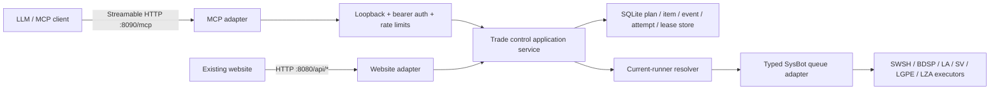

# PokeBot MCP control-plane plan

Status: Phases 0 through 6 are implemented and pass the automated release
gates as of 2026-07-29. Native Switch UAT remains required before enabling
non-blocking trade-evolution policies or calling the control plane
hardware-certified.

## Decision

Add a dedicated, loopback-only MCP control plane for planning and supervising
durable multi-Pokémon trade operations. Keep the existing website API intact.
Both adapters will eventually call one shared `TradeOrchestrator`; neither
adapter will own trade state.

The initial deployment shape is:

- Website: existing `HttpListener` on port 8080, unchanged.
- MCP: ASP.NET Core/Kestrel Streamable HTTP on
  `http://127.0.0.1:8090/mcp` by default. `POKEBOT_MCP_PORT` can select
  another dedicated port.
- Authentication: a dedicated bearer secret loaded from
  `POKEBOT_MCP_TOKEN`; never place a token in a tool schema or log.
- Session model: stateless MCP requests backed by durable operation state.
- Long-running behavior: every mutation returns an operation ID. Clients poll
  the operation and its event stream. MCP Tasks can be added as a compatible
  projection later, but the durable operation ID remains canonical.

This endpoint is an operational control plane, not a raw Switch-memory API.
It will not expose arbitrary button presses, memory addresses, file paths,
last-millisecond held-item injection, or a way to bypass legality/item policy.
A separate lab-only interface would require new live pointer evidence,
explicit enablement, and game/version-specific safety gates.

## Re-audited owners and constraints

| Concern | Current owner/evidence | Design consequence |
| --- | --- | --- |
| Game modes | `ProgramConfig.Mode`: SWSH, BDSP, LA, SV, LGPE, LZA | The contract supports all six Switch executors. |
| Current runtime | `Main.RunningEnvironment`; replaced by `UpdateRunnerAndUI` | Resolve `IPokeBotRunner` on every call. Never capture the startup runner. |
| Website routes | `WebApi/BotServer.cs` and `TradeApiHandler.cs` | Do not add MCP routing to the existing large `HttpListener`. |
| Queue writes | Generic `PokeBotRunner<T>.Hub.Queues.Info` | Put generic dispatch behind one typed runtime adapter. |
| Website mode dispatch | `TradeApiHandler` has explicit typed switches | Shared orchestration must include LGPE; the current website generation path does not. |
| Existing batch execution | Each game consumes `PokeTradeDetail.BatchTrades` sequentially | Reuse executors, but do not treat their in-memory batch tracker as durable plan state. |
| Reconnect | `PokeRoutineExecutor.TryReconnect` resets immediately, then waits about 30 seconds | Add staged control-plane policy and durable attempt records before changing executor timing. |
| Trade evolution detection | `TradeEvolutions.WillTradeEvolve` plus per-game guards | Default to `block`; automatic animation handling is not yet proven across games and batch paths. |

## Target architecture



### Required seams

1. `ICurrentTradeRuntime`
   - Reads the current `IPokeBotRunner` for each operation.
   - Reports current mode, bot instances, connection state, queue availability,
     and a runtime generation/version value.
   - Rejects a request if the mode changes between validation and enqueue.

2. `ITradeQueueAdapter`
   - Converts prepared plan items into the correct `PokeTradeDetail<T>`.
   - Supports all six `ProgramMode` values.
   - Returns stable domain results instead of `null`/generic exceptions.

3. `ITradePlanStore`
   - Persists plans, items, events, attempts, idempotency keys, and leases.
   - Uses transactions for state transition plus event append.
   - Supports restart recovery without assuming the console trade completed.

4. `TradeOrchestrator`
   - Owns validation, state transitions, dispatch, retry, pause/resume,
     cancellation, and attention resolution.
   - Serializes execution per bot instance.
   - Never retries automatically after the irreversible confirmation boundary
     unless settlement is proven not to have occurred.

## Contract source of truth

`contracts/pokebot-control-v1.openapi.json` is the versioned application
contract. Its `operationId` values are canonical MCP tool names. The MCP
transport remains `/mcp`; the OpenAPI paths describe application operations
that generated MCP handlers call.

V1 tools:

| Intent | Canonical tool |
| --- | --- |
| Discover current bot/runtime state | `list_bot_instances` |
| Validate a complete plan without persisting it | `validate_trade_plan` |
| Create a durable draft | `create_trade_plan` |
| Read a plan and its item progress | `get_trade_plan` |
| Enqueue a validated plan | `enqueue_trade_plan` |
| Read long-running operation state | `get_trade_operation` |
| Read paginated operation events | `list_trade_events` |
| Pause after the current safe boundary | `pause_trade_operation` |
| Resume a paused operation | `resume_trade_operation` |
| Cancel at the next safe boundary | `cancel_trade_operation` |
| Resolve an uncertain item explicitly | `resolve_trade_attention` |

V1 deliberately has no mega-tool, raw command tool, arbitrary URL/file input,
or secret field. Cancellation and attention resolution require an explicit
`confirm: true`.

## Durable model

### Plan

Required fields:

- `plan_id`, `owner_id`, `game_mode`, `state`, `created_at`, `updated_at`
- normalized link code/pictocode input appropriate to the game
- ordered item IDs
- policy snapshot
- validation/runtime version

Plan states:

`draft -> validated -> queued -> running -> completed`

Side states are `paused`, `needs_attention`, `failed`, and `cancelled`.
Completed, failed, and cancelled are terminal.

### Item

Required fields:

- `item_id`, `plan_id`, `position`, `state`
- original Pokémon request and normalized prepared artifact metadata
- validation result and hash
- attempt count, last error, and settlement evidence

Item states:

`pending -> prepared -> searching -> partner_found -> offered -> confirming -> settling -> completed`

Side states are `needs_attention`, `skipped`, and `failed`. The item-level
`needs_attention` state is mandatory: a plan-level flag alone cannot identify
which trade has uncertain settlement or prevent accidental duplicate delivery.

### Event and attempt

Every state change appends an immutable event with sequence number, timestamp,
operation ID, plan ID, optional item ID, event type, and redacted details.
Every search/connection attempt records its start, end, failure class, and
whether the irreversible boundary was crossed.

### Lease

Only one active operation may own a bot instance. A renewable lease prevents
two MCP clients, the website, or a restart recovery worker from dispatching the
same plan concurrently. Queue admission still uses the existing SysBot queue;
the lease protects orchestration ownership.

## Recovery policy

Default policy values are encoded in `TradePlanPolicies`:

- Transport reconnect delays: 0 ms, 250 ms, 1 s, 5 s, then 30 s.
- Partner-disconnect attempts: 3 for the current item.
- Retry exhaustion: pause the plan.
- Uncertain settlement: set the item and plan to `needs_attention`.
- Evolution: block.

Failure classification:

| Failure | Default behavior |
| --- | --- |
| Transport disconnected before confirmation | Reconnect using staged delays, restore the game to a known screen, then retry the current item. |
| Partner disconnected before confirmation | Search again for the current item, bounded by policy. |
| Failure after confirmation but before settlement proof | Do not retry. Enter `needs_attention`. |
| Validation/legality/item block | Fail the item before queueing; do not mutate a live slot. |
| Mode changed | Pause/fail with `MODE_MISMATCH`; revalidate against the new runtime. |
| Bot process restart | Rehydrate nonterminal operations, reacquire leases, and reconcile runtime/queue state before continuing. |
| Retry exhausted | Pause by default; an explicit policy may skip or cancel. |

Idempotency keys are required for create/enqueue mutations. Replaying a request
with the same key returns the original resource/operation; a different payload
with the same key returns `PLAN_CONFLICT`.

## Trade-evolution boundary

The shared evolution table is not game-aware, and executor behavior is not
uniform:

| Mode | Ordinary-path guard | Batch-path observation | V1 policy |
| --- | --- | --- | --- |
| SWSH | Present before ordinary confirmation | No equivalent pre-confirm batch guard | Block |
| BDSP | Present before ordinary confirmation; also checked after EC change | Batch reaches the late EC-change check, after confirmation has begun | Block |
| LA | Present before ordinary confirmation; also checked after EC change | No separately proven batch animation handler | Block |
| SV | Present before ordinary confirmation; also checked after EC change | Batch reaches the late EC-change check, after confirmation has begun | Block |
| LGPE | No `TradeEvolutions` guard found | No guard or evolution-state handler found | Block |
| LZA | Present before ordinary confirmation | No equivalent batch guard; menu state only identifies overworld/menu/link/box | Block |

`allow_manual` and `allow_and_handle` remain contract values for forward
compatibility, but the orchestrator must reject them with
`EVOLUTION_REQUIRES_ATTENTION` until that game has:

1. a game-specific evolution capability table;
2. pre-confirm detection in ordinary and batch paths;
3. observed screen/state evidence for the evolution and move-learning flows;
4. bounded button handling and recovery;
5. native Switch UAT for every supported branch.

BDSP exposes an evolution scene ID, but that alone is not enough to claim the
full animation flow. SV uses a broader scene value that is not a unique,
verified evolution window. LZA currently has no evolution-specific menu state.

## Error contract

All adapters return:

```json
{
  "code": "SETTLEMENT_UNCERTAIN",
  "message": "Trade confirmation began, but completion could not be proven.",
  "details": {
    "plan_id": "plan_...",
    "item_id": "item_..."
  }
}
```

Stable V1 codes:

- `INVALID_REQUEST`
- `BOT_OFFLINE`
- `BOT_BUSY`
- `MODE_MISMATCH`
- `QUEUE_CLOSED`
- `LEGALITY_FAILED`
- `ITEM_BLOCKED`
- `PLAN_CONFLICT`
- `PARTNER_DISCONNECTED`
- `TRANSPORT_DISCONNECTED`
- `SETTLEMENT_UNCERTAIN`
- `EVOLUTION_BLOCKED`
- `EVOLUTION_REQUIRES_ATTENTION`
- `RATE_LIMITED`
- `CONFIRMATION_REQUIRED`

Transport/auth/protocol failures remain separate from these domain errors.

## Security and operational gates

- Bind MCP to `127.0.0.1` by default. External binding is not a V1 setting.
- Read the bearer token from the environment and redact authorization headers.
- Derive `owner_id` and idempotency scope from the authenticated principal;
  never accept owner identity from an MCP tool argument.
- Reject missing/short/default tokens at startup.
- Rate-limit mutations per authenticated principal and per bot instance.
- Cap plan size, Showdown text length, event page size, and request body size.
- Never accept arbitrary URLs, paths, memory addresses, or raw Switch commands.
- Validate and prepare every Pokémon before a plan can be enqueued.
- Recheck blocked items and legality immediately before dispatch.
- Audit every mutation without logging full tokens or sensitive trainer data.
- Require explicit confirmation for cancellation and attention resolution.

## Delivery phases

### Phase 0 — contract foundation (completed)

- Add this architecture/rollout document.
- Add versioned OpenAPI operation contract.
- Add plan/item states, conservative policy defaults, structured error type,
  and transition rules.
- Add unit and contract tests.

Exit gate: core project builds; focused tests pass; no website or live executor
behavior changes.

### Phase 1 — durable application core (completed)

- Add SQLite schema/migrations for plans, items, events, attempts,
  idempotency, and leases.
- Implement transactional repositories and restart reconciliation.
- Implement validation and plan creation without queue dispatch.
- Add clock/ID abstractions and concurrency tests.

Exit gate: restart/concurrency/idempotency tests pass; no MCP package required.

Implemented:

- Schema migration V1 covers plans, ordered items, operations, globally
  sequenced events, attempts, idempotency records, and per-bot leases.
- `ITradePlanStore` keeps the application core independent from SQLite.
- `TradePlanApplicationService` validates numeric link codes versus LGPE
  pictocodes across all six modes, derives owner scope outside tool inputs,
  computes request hashes, and owns clock/UUID-v7 ID seams.
- `SqliteTradePlanStore` uses WAL, foreign keys, full synchronous durability,
  short transactions, state/version checks, and bounded busy timeouts.
- Item `needs_attention` escalation updates the item, operation, plan, evidence,
  and event atomically.
- Plan validation fails until every item is prepared; operation completion
  fails while any item is unfinished.
- Lease acquisition is exclusive, renewable only by the current owner, and
  permits takeover only after expiry.
- The stable `Microsoft.Data.Sqlite` dependency is paired with
  `SQLitePCLRaw.bundle_e_sqlite3` 2.1.12 to avoid the vulnerable native
  2.1.11 transitive version.

### Phase 2 — current-runtime and queue adapters (completed)

- Implement `ICurrentTradeRuntime` against `Main.Runner` through a narrow,
  thread-safe resolver.
- Implement typed queue dispatch for all six modes, including LGPE.
- Translate existing queue/notifier results into stable operation events.
- Revalidate mode, legality, and blocked-item policy before dispatch.

Exit gate: fake-runner integration tests cover every mode; current website
behavior remains unchanged.

Implemented:

- `CurrentTradeRuntime` re-resolves `Main.Runner` on every call and increments
  a generation when the runner or mode changes.
- `SysBotTradeQueueAdapter` prepares, legality-checks, item-policy-checks, and
  queues the correct `PK8`, `PB8`, `PA8`, `PK9`, `PB7`, or `PA9` type.
- Queue callbacks are translated into typed lifecycle events without exposing
  arbitrary Switch inputs or memory access.

### Phase 3 — MCP host (completed)

- Add a dedicated .NET host/project and pin the selected C# MCP SDK version.
- Map loopback Streamable HTTP `/mcp`, bearer authentication, limits, health,
  and the V1 tools derived from the OpenAPI operation IDs.
- Return operation handles rather than holding tool calls open.
- Snapshot and strictly validate the generated tool manifest.

Exit gate: MCP Inspector/client contract tests pass; auth, cancellation,
redaction, rate limit, and malformed request tests pass.

Implemented:

- `SysBot.Pokemon.Mcp` pins stable `ModelContextProtocol.AspNetCore` 2.0.0 and
  exposes exactly the 11 OpenAPI `operationId` tools.
- Kestrel binds only to loopback, validates local origins and host headers,
  requires a high-entropy bearer token, derives the owner from its hash, caps
  request bodies, rate-limits requests and mutations, and emits no-store
  responses.
- The default port is 8090 rather than 8081 because the existing PokeBot
  multi-process IPC allocator already starts at 8081. An invalid
  `POKEBOT_MCP_PORT` fails closed.
- A real SDK client integration test authenticates, discovers the exact tool
  set, and invokes a tool.

### Phase 4 — queue supervision and recovery (completed, native UAT pending)

- Implement durable dispatcher, per-bot lease, staged reconnect, partner
  re-search, pause/resume/cancel safe boundaries, and attention workflow.
- Reconcile restarts without duplicate delivery.
- Add fault injection for disconnects at every item state.

Exit gate: deterministic recovery tests plus live disconnect UAT.

Implemented:

- SQLite-backed operation, item, attempt, event, idempotency, and renewable
  lease state supervise each in-memory queue registration.
- Partner disconnects before confirmation re-search the current item using a
  bounded staged policy; the next batch item is not advanced until settlement
  evidence completes the previous item.
- Restarts before confirmation close the old attempt, stage
  `running -> paused -> queued`, wait for runtime readiness, reacquire a lease
  and observer, and requeue. Restarts at confirmation or settlement never
  retry and enter `needs_attention`.
- Pause and cancel defer at irreversible boundaries. Attention resolution
  requires an explicit confirmed mutation.
- All mutation idempotency keys are durably claimed and conflicting reuse is
  rejected.

### Phase 5 — evolution capability work (completed fail-closed)

- Build game-specific capability probes and pre-confirm parity.
- Add animation/move-learning handlers one game at a time.
- Enable `allow_manual`/`allow_and_handle` only behind per-game capability
  flags after native evidence.

Exit gate: game-specific native UAT matrix; otherwise policy stays `block`.

Implemented:

- A six-game capability registry records ordinary detection, batch detection,
  animation handling, move-learning handling, and native-validation evidence
  independently.
- Every control-plane executor re-reads the partner offer immediately before
  confirmation and blocks a detected trade evolution under the V1 policy.
- `allow_manual` and `allow_and_handle` remain rejected for every game because
  animation/move-learning/native evidence is incomplete. This is the intended
  completed V1 safety posture, not a claim that animation automation exists.

### Phase 6 — website convergence (completed, live UAT pending)

- Move website trade submission behind the same application service without
  changing the public website contract.
- Remove duplicate in-memory ownership only after compatibility tests and a
  rollback window.

Exit gate: REST regression suite and live website trade UAT.

Implemented:

- Direct `/api/trade` and `/api/trade/batch` submissions and Supabase polling
  create the same durable plans and operations as MCP.
- The public REST fields and Supabase status vocabulary remain projections;
  they no longer own retries or settlement.
- Website Discord identity, favored priority, LGPE pictocodes, queue position,
  bypass count, cancel behavior, and hourly-limit reservations are preserved.
  Hourly slots are consumed only for settled items and an untraded remainder
  is released at a terminal outcome.
- The legacy typed website enqueue remains as an initialization-failure
  rollback path during the compatibility window.

## Operator and LLM connection

Set a unique secret of at least 32 non-whitespace characters before starting
PokeBot. The optional port variable is only needed when 8090 is unavailable:

```powershell
$env:POKEBOT_MCP_TOKEN = "<generate-a-unique-high-entropy-secret>"
$env:POKEBOT_MCP_PORT = "8090"
```

Configure the MCP client for Streamable HTTP at
`http://127.0.0.1:8090/mcp` and send:

```text
Authorization: Bearer <same secret>
```

The client should use this sequence:

1. `list_bot_instances` and retain the reported runtime generation.
2. `validate_trade_plan` with all ordered Pokémon requests.
3. `create_trade_plan` with a caller-stable idempotency key.
4. `enqueue_trade_plan` with another caller-stable idempotency key.
5. Poll `get_trade_operation` and `list_trade_events`; do not repeat an item
   merely because a tool call or network connection timed out.
6. Use pause, resume, or confirmed cancellation only at the operation level.
7. If the operation enters `needs_attention`, inspect the item and settlement
   evidence before calling `resolve_trade_attention`.

A single plan can contain up to 100 ordered items. It is the supported way for
an LLM to manage a long queue: the dispatcher re-searches the current item
after a reversible disconnect, advances only after settlement evidence, and
continues with the next item. Creating parallel plans for one trainer is not a
replacement for one ordered plan because the existing SysBot queue prevents
duplicate trainer entries.

## Verification matrix

Automated:

- State transition and fail-closed policy tests.
- OpenAPI operation-name, safety-input, and secret/path lint tests.
- Repository migration, idempotency, transaction, lease, and restart tests.
- Six-mode runtime adapter tests.
- Disconnect-before-confirmation, disconnect-after-confirmation, retry
  exhaustion, and mode-switch tests.
- MCP auth, schema, structured error, pagination, timeout, and rate-limit tests.

Native/manual:

- One ordinary and one multi-item trade for each supported game.
- Wi-Fi disconnect during search, partner disconnect before confirmation,
  process restart between items, and cancellation at safe boundaries.
- Evolution and move-learning branches before enabling any non-block policy.

No automated test can replace the native confirmation/evolution timing checks.

## Current references

- [Official C# MCP SDK releases](https://github.com/modelcontextprotocol/csharp-sdk/releases)
- [MCP Tasks specification](https://modelcontextprotocol.io/specification/2025-11-25/basic/utilities/tasks)
- [MCP 2026-07-28 release candidate overview](https://blog.modelcontextprotocol.io/posts/2026-07-28-release-candidate/)
